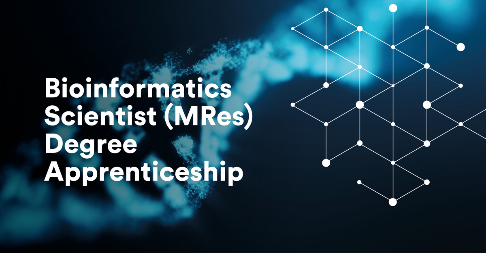

# Bioinformatics Scientist MRes Apprenticeship

[Apprenticeship Course Homepage](https://www.nottingham.ac.uk/vet/study-with-us/degree-apprenticeships/level-7-bioinformatics-scientist-degree-apprenticeship.aspx)

### **Module One - Bioinformatics Methods**

*1. RNASeq Submission file*  
*2. RNASeq Genome file*

Calculating differential gene expression online

http://bioinformatics.sdstate.edu/idep/

Ge, S.X., Son, E.W. & Yao, R. iDEP: an integrated web application for differential expression and pathway analysis of RNA-Seq data. BMC Bioinformatics 19, 534 (2018). https://doi.org/10.1186/s12859-018-2486-6

### **Module Two - Introduction to Statistics**

*1. Test datasets*  
*2. Guide to SPSS*

### **Module Three - Programming in Python**

*1. Multi-fasta file*

### **Module Four - Programming in R**

*1. Test datasets*
